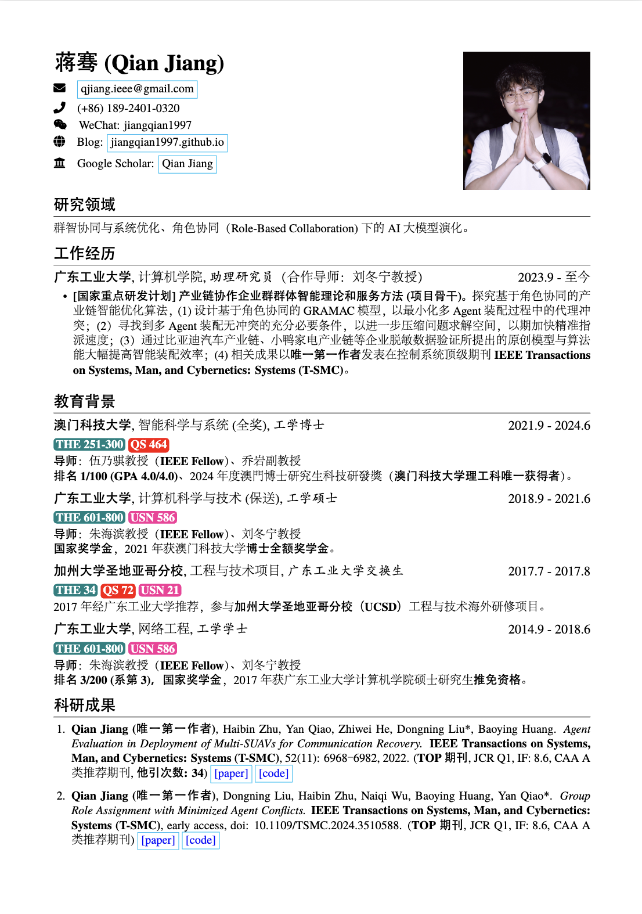

# 个人简历

本项目为个人简历 Latex 源码存放，同时包含效果图呈现，简历入口为 resume-zh_CN.tex， 修改自项目 [chinese_resume](https://github.com/jiangqian1997/chinese_resume)，若不想本地手动编译可以将该源码打包至 zip 直接上传至 Overleaf 进行在线编译与预览。

## 项目说明

一个优雅的 \LaTeX\ 简历模板, 使用 \XeLaTeX\ 编译, 因为受不了古老的`res`和不太适合作为一页纸的科研简历的`moderncv`（主要是申请教职一直被拒，写的不够清晰）, 遂根据以下项目作为基础模版修改了较为合适的科研中文简历：

- [hijiangtao/resume](https://github.com/hijiangtao/resume?tab=readme-ov-file)

## 特性

- 极其容易定制和扩展 (`res`模板中枪倒地...)
- 完善的 Unicode 字体支持, 因为用的是 \XeLaTeX\ 嘛
- 完美的中文支持，使用 Adobefonts
- 支持 FontAwesome 4.3.0 (目前还不支持使用别名)

### 效果输出



## 使用方法

1. ShareLaTeX 在线编译
2. 使用较新的 \LaTeX\ 发行版在本地计算机编译

包含 Adobe 的宋楷黑仿四套中文字体，体积较大，可直接下载压缩包文件，[下载地址](https://github.com/jiangqian1997/chinese_resume/releases)。

## 如何 Fork 本项目到本地并建立连接

如果你想 Fork 本项目到本地并保持与原始仓库的同步，可以按照以下步骤操作：

### 1. 在 GitHub 上 Fork 项目
1. 打开项目的 GitHub 页面（例如：[jiangqian1997/chinese_resume](https://github.com/jiangqian1997/chinese_resume)）。
2. 点击右上角的 **Fork** 按钮，将项目 Fork 到你的 GitHub 账号中。

### 2. 克隆 Fork 的项目到本地
在你的终端中执行以下命令（将 `<你的用户名>` 替换为你的 GitHub 用户名）：
```bash
git clone https://github.com/<你的用户名>/chinese_resume.git

如果系统已确定安装有 Adobe 的四套中文字型，在文档的开始处使用包`zh_CN-Adobefonts_internal`, 如果没有安装则使用包`zh_CN-Adobefonts_external`, 在 ShareLaTeX 上编译需要使用包`zh_CN-Adobefonts_external`.

其他具体使用可参考给出的范例，都是极其简单易懂的宏，建议先看看 [How to write a LaTeX class file and design your own CV (Part 1) - ShareLaTeX](https://www.sharelatex.com/blog/2011/03/27/how-to-write-a-latex-class-file-and-design-your-own-cv.html) 和 [How to write a LaTeX class file and design your own CV (Part 2) - ShareLaTeX](https://www.sharelatex.com/blog/2013/06/28/how-to-write-a-latex-class-file-and-design-your-own-cv.html) 了解下该模板的简单背景，下面就一些新定义的宏做简要介绍。

### 宏

- `\name`: 姓名
- `\FancyBadge`: 用于表示学校的国际排名，如Times、QS和软科等
- `\PaperBoxLink`: [paper] 超链接的调用
- `\CodeBoxLink`: [code] 超链接的调用
- `\AwardBoxLink`: [award] 超链接的调用
- `\section`: 用于分节, 如教育背景, 实习/项目经历等
- `\subsection`: 用于小节标题, 无日期选项
- `\datedsubsection`: 用于小节标题, 简历中使用最广，第二项为时间区间，自动右对齐
- `\itemize`: 清单列表，简历中应用最广
- `\enumerate`: 枚举列表，数字标号

### FontAwesome

首先在 [Font Awesome Icons](http://fortawesome.github.io/Font-Awesome/icons/) 上选中自己想使用的图标(暂不支持 alias)，然后在 [fontawesome.sty](https://github.com/billryan/resume/blob/zh_CN/fontawesome.sty) 中找到相应的宏, 将其作为普通文本一样使用。

其他的可以自行参考相应 cls 和 tex 文件。

## License

[The MIT License (MIT)](http://opensource.org/licenses/MIT)

Copyrighted fonts are not subjected to this License.
